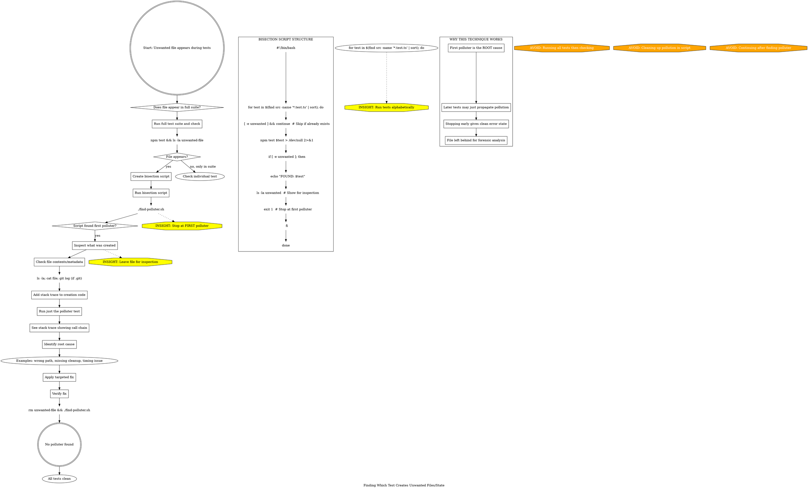

**When to use:** Tests create unwanted files/state but you don't know which test.

**Technique:** Linear bisection - run tests alphabetically, stop at first pollution.

**Critical:** STOP at first polluter and leave pollution for inspection.

**Why:** First polluter is the root cause. Later tests may just propagate existing pollution.

**This session:** Found `agent.test.ts` created `.git` in `packages/core` by running tests one-by-one until `.git` appeared.

**Script template:** Loop through tests, check before/after each, exit on first detection.
