```dot
digraph CREATE_VALIDATION_TESTS {
    label="Using Validation Tests to Catch Infrastructure Problems";

    // Entry
    "Start: Fixed a bug, want to prevent regression" [shape=doublecircle];

    // The technique
    "Create a validation test" [shape=box];
    "Test the invariant, not the behavior" [shape=box];

    // Examples of invariants
    subgraph cluster_invariants {
        label="EXAMPLES OF INVARIANTS";

        inv1 [label="No files created in source directories", shape=ellipse];
        inv2 [label="All resources cleaned up after tests", shape=ellipse];
        inv3 [label="No processes left running", shape=ellipse];
        inv4 [label="Temp directories empty after cleanup", shape=ellipse];
        inv5 [label="Database connections closed", shape=ellipse];
    }

    // Structure of validation test
    "Test structure" [shape=box];

    subgraph cluster_structure {
        label="VALIDATION TEST STRUCTURE";

        struct1 [label="1. Record initial state", shape=box];
        struct2 [label="2. Run the operation", shape=box];
        struct3 [label="3. Assert invariant holds", shape=box];
        struct4 [label="4. Clean up", shape=box];
        struct5 [label="5. Assert invariant STILL holds", shape=box];

        struct1 -> struct2 -> struct3 -> struct4 -> struct5;

        example [label="Example: No .git pollution\n\n1. Check .git doesn't exist\n2. Create workspace\n3. Assert .git still doesn't exist in source\n4. Destroy workspace\n5. Assert .git STILL doesn't exist", shape=plaintext];
    }

    // Where to put validation tests
    "Where to place test?" [shape=diamond];
    "Co-locate with feature tests" [shape=box];
    "Example: workspace-cleanup-validation.test.ts" [shape=ellipse];

    // What makes a good validation test
    "Good validation test properties" [shape=box];

    subgraph cluster_properties {
        label="GOOD VALIDATION TEST PROPERTIES";

        prop1 [label="Tests ONE clear invariant", shape=box];
        prop2 [label="Fails loudly when invariant violated", shape=box];
        prop3 [label="Clear error message explaining what went wrong", shape=box];
        prop4 [label="Runs as part of normal test suite", shape=box];
        prop5 [label="Fast (no slow operations if possible)", shape=box];

        prop1 -> prop2 -> prop3 -> prop4 -> prop5;
    }

    // When to create validation tests
    "When to create?" [shape=diamond];

    "After fixing hard-to-debug bug" [shape=box];
    "After adding important invariant" [shape=box];
    "After cleanup refactoring" [shape=box];
    "When adding dangerous features" [shape=box];

    // Example from this session
    subgraph cluster_example {
        label="EXAMPLE FROM THIS SESSION";

        ex_bug [label="Bug: Tests creating .git in packages/core", shape=ellipse];
        ex_fix [label="Fix: Multiple validation layers", shape=box];
        ex_test [label="Validation test:\nshould NOT create .git in source", shape=box];

        ex_test_code [label="it('should NOT create .git', async () => {\n  const before = existsSync(SOURCE_DIR + '/.git');\n  await manager.createWorkspace(tempDir, sessionId);\n  const after = existsSync(SOURCE_DIR + '/.git');\n  expect(after).toBe(before); // Should not change\n  expect(after).toBe(false);  // Should never exist\n})", shape=plaintext];

        ex_benefit [label="Benefit: Catches regression immediately", shape=doublecircle];

        ex_bug -> ex_fix -> ex_test -> ex_test_code -> ex_benefit;
    }

    // Success
    "Validation test in suite" [shape=doublecircle];
    "Regression impossible without test failure" [shape=doublecircle];

    // Flow
    "Start: Fixed a bug, want to prevent regression" -> "Create a validation test";
    "Create a validation test" -> "Test the invariant, not the behavior";

    "Test the invariant, not the behavior" -> "Test structure";
    "Test structure" -> "Good validation test properties";
    "Good validation test properties" -> "Where to place test?";

    "Where to place test?" -> "Co-locate with feature tests" [label="yes"];
    "Co-locate with feature tests" -> "Example: workspace-cleanup-validation.test.ts";

    "Example: workspace-cleanup-validation.test.ts" -> "Validation test in suite";
    "Validation test in suite" -> "Regression impossible without test failure";

    "When to create?" -> "After fixing hard-to-debug bug" [label="timing"];
    "When to create?" -> "After adding important invariant" [label="timing"];
    "When to create?" -> "After cleanup refactoring" [label="timing"];
    "When to create?" -> "When adding dangerous features" [label="timing"];

    "After fixing hard-to-debug bug" -> "Create a validation test" [style=dotted];
    "After adding important invariant" -> "Create a validation test" [style=dotted];
    "After cleanup refactoring" -> "Create a validation test" [style=dotted];
    "When adding dangerous features" -> "Create a validation test" [style=dotted];

    // Anti-patterns
    "AVOID: Testing implementation details" [shape=octagon, style=filled, fillcolor=orange, fontcolor=white];
    "AVOID: Validation test that's slow" [shape=octagon, style=filled, fillcolor=orange, fontcolor=white];
    "AVOID: Multiple invariants in one test" [shape=octagon, style=filled, fillcolor=orange, fontcolor=white];

    // Best practices
    "BEST: One invariant per test" [shape=octagon, style=filled, fillcolor=green, fontcolor=white];
    "BEST: Test runs fast (< 1s)" [shape=octagon, style=filled, fillcolor=green, fontcolor=white];
    "BEST: Error message says WHY it failed" [shape=octagon, style=filled, fillcolor=green, fontcolor=white];
}
```

**When to use:** After fixing a hard-to-debug bug, create a test that validates the invariant to prevent regression.

**Key insight:** Test the INVARIANT (what should never happen), not the implementation (how it's prevented).

**Example from this session:**
- Invariant: "No .git should exist in packages/core after tests"
- Test: Check before/after workspace operations
- Benefit: Catches regression immediately

**Properties of good validation tests:**
- ONE clear invariant
- Fast execution
- Fails loudly with clear message
- Runs in normal test suite
