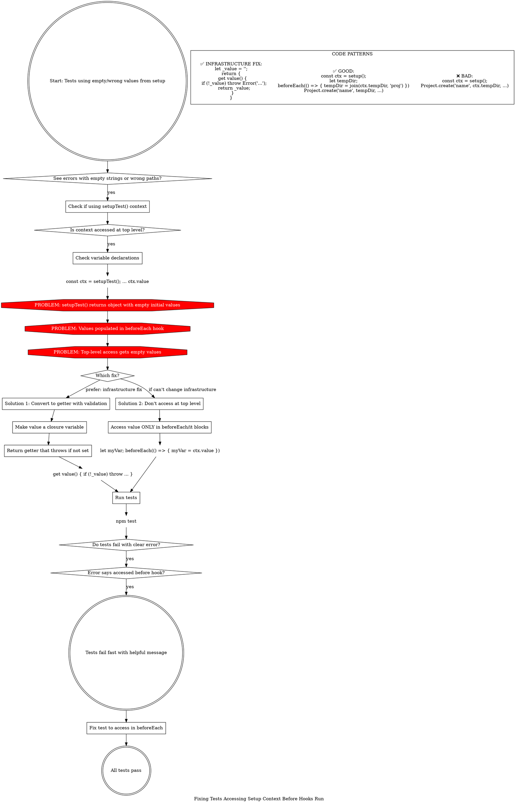

**When to use:** Tests fail with empty strings, undefined values, or wrong paths that come from test setup utilities.

**Root cause:** Test setup functions return objects with initial empty values, populated later in hooks. Top-level access gets empty values.

**Best fix:** Convert values to getters with validation (infrastructure fix, catches all cases).

**Alternative:** Fix tests to not access at top level (symptom fix, error-prone).
