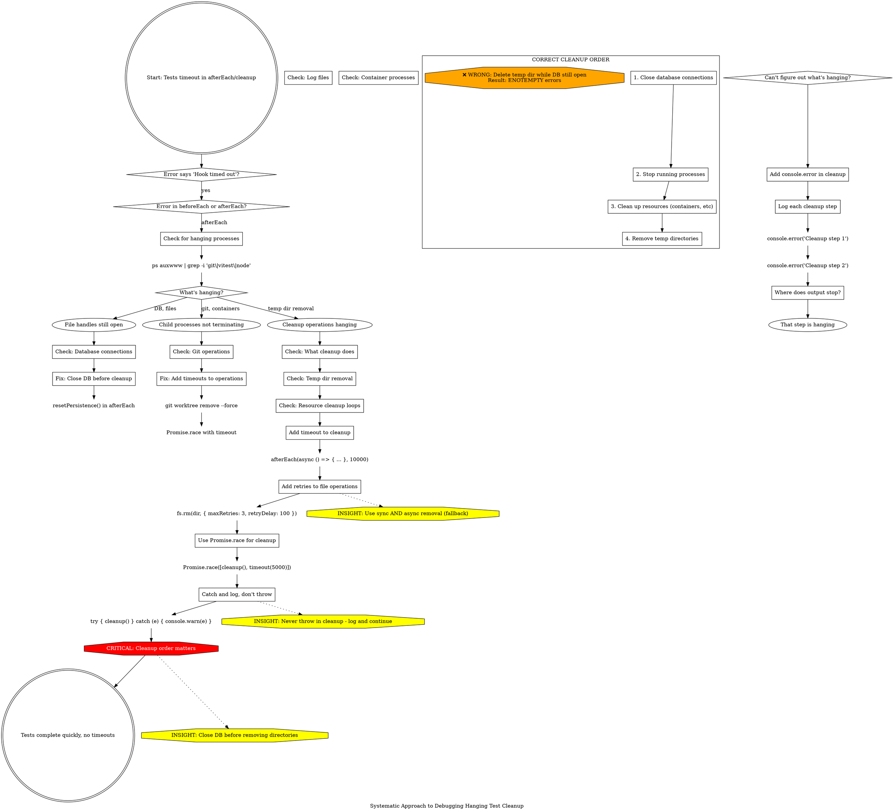

**When to use:** Tests are timing out in cleanup hooks, preventing test completion.

**Root causes:** File handles, child processes, or cleanup operations hanging.

**Key techniques:**
1. **Cleanup order matters:** DB first, processes second, resources third, directories last
2. **Add timeouts everywhere:** afterEach timeout, Promise.race, command timeouts
3. **Fallback strategies:** Try async rm, fall back to sync rmSync
4. **Never throw in cleanup:** Log warnings, continue best-effort

**Debugging:** Add console.error at each cleanup step to find where it hangs.
