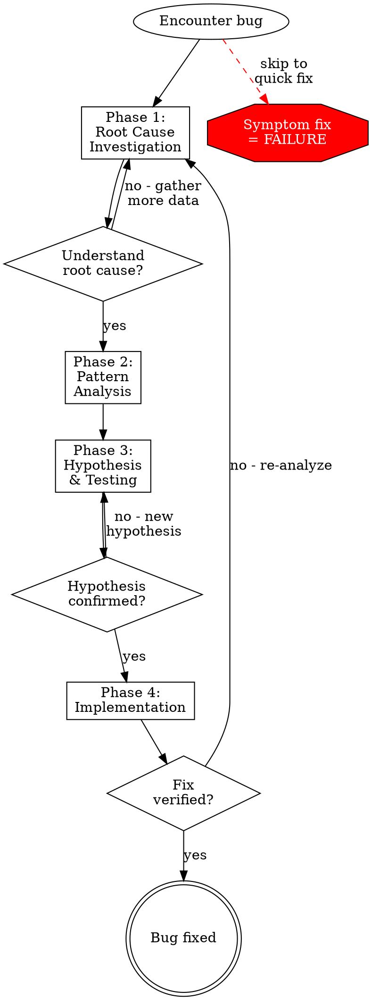

# Systematic Debugging

## Overview

Random fixes waste time and create new bugs. Quick patches mask underlying issues.

**Core principle:** ALWAYS find root cause before attempting fixes. Symptom fixes are failure.

**Violating the letter of this process is violating the spirit of debugging.**

## When to Use

Use for ANY technical issue:
- Test failures
- Bugs in production
- Unexpected behavior
- Performance problems
- Build failures
- Integration issues

**Use this ESPECIALLY when:**
- Under time pressure (emergencies make guessing tempting)
- "Just one quick fix" seems obvious
- You've already tried multiple fixes
- Previous fix didn't work
- You don't fully understand the issue

**Don't skip when:**
- Issue seems simple (simple bugs have root causes too)
- You're in a hurry (rushing guarantees rework)
- Manager wants it fixed NOW (systematic is faster than thrashing)

## The Four Phases

You MUST complete each phase before proceeding to the next.

### Phase 1: Root Cause Investigation

**BEFORE attempting ANY fix:**

1. **Read Error Messages Carefully**
   - Don't skip past errors or warnings
   - They often contain the exact solution
   - Read stack traces completely
   - Note line numbers, file paths, error codes

2. **Reproduce Consistently**
   - Can you trigger it reliably?
   - What are the exact steps?
   - Does it happen every time?
   - If not reproducible → gather more data, don't guess

3. **Check Recent Changes**
   - What changed that could cause this?
   - Git diff, recent commits
   - New dependencies, config changes
   - Environmental differences

### Phase 2: Pattern Analysis

**Find the pattern before fixing:**

1. **Find Working Examples**
   - Locate similar working code in same codebase
   - What works that's similar to what's broken?

2. **Compare Against References**
   - If implementing pattern, read reference implementation COMPLETELY
   - Don't skim - read every line
   - Understand the pattern fully before applying

3. **Identify Differences**
   - What's different between working and broken?
   - List every difference, however small
   - Don't assume "that can't matter"

4. **Understand Dependencies**
   - What other components does this need?
   - What settings, config, environment?
   - What assumptions does it make?

### Phase 3: Hypothesis and Testing

**Scientific method:**

1. **Form Single Hypothesis**
   - State clearly: "I think X is the root cause because Y"
   - Write it down
   - Be specific, not vague

2. **Test Minimally**
   - Make the SMALLEST possible change to test hypothesis
   - One variable at a time
   - Don't fix multiple things at once

3. **Verify Before Continuing**
   - Did it work? Yes → Phase 4
   - Didn't work? Form NEW hypothesis
   - DON'T add more fixes on top

4. **When You Don't Know**
   - Say "I don't understand X"
   - Don't pretend to know
   - Ask for help
   - Research more

### Phase 4: Implementation

**Fix the root cause, not the symptom:**

1. **Create Failing Test Case**
   - Simplest possible reproduction
   - Automated test if possible
   - One-off test script if no framework
   - MUST have before fixing
   - See @test-driven-development for writing proper failing tests that prove the fix

2. **Implement Single Fix**
   - Address the root cause identified
   - ONE change at a time
   - No "while I'm here" improvements
   - No bundled refactoring

3. **Verify Fix**
   - Test passes now?
   - No other tests broken?
   - Issue actually resolved?

4. **If Fix Doesn't Work**
   - STOP
   - Don't add more fixes
   - Return to Phase 1
   - Re-analyze with new information

## Red Flags - STOP and Follow Process

If you catch yourself thinking:
- "Quick fix for now, investigate later"
- "Just try changing X and see if it works"
- "Add multiple changes, run tests"
- "Skip the test, I'll manually verify"
- "It's probably X, let me fix that"
- "I don't fully understand but this might work"
- "Pattern says X but I'll adapt it differently"

**ALL of these mean: STOP. Return to Phase 1.**

## Common Rationalizations

| Excuse | Reality |
|--------|---------|
| "Issue is simple, don't need process" | Simple issues have root causes too. Process is fast for simple bugs. |
| "Emergency, no time for process" | Systematic debugging is FASTER than guess-and-check thrashing. |
| "Just try this first, then investigate" | First fix sets the pattern. Do it right from the start. |
| "I'll write test after confirming fix works" | Untested fixes don't stick. Test first proves it. |
| "Multiple fixes at once saves time" | Can't isolate what worked. Causes new bugs. |
| "Reference too long, I'll adapt the pattern" | Partial understanding guarantees bugs. Read it completely. |

## Process Flowchart



## Quick Reference

| Phase | Key Activities | Success Criteria |
|-------|---------------|------------------|
| **1. Root Cause** | Read errors, reproduce, check changes | Understand WHAT and WHY |
| **2. Pattern** | Find working examples, compare | Identify differences |
| **3. Hypothesis** | Form theory, test minimally | Confirmed or new hypothesis |
| **4. Implementation** | Create test, fix, verify | Bug resolved, tests pass |

## Real-World Examples

### Good Process

```
Bug: API returns 500 error

Phase 1:
- Error log: "Database connection timeout"
- Reproduced: Every request to /users endpoint
- Recent change: Added connection pooling yesterday

Phase 2:
- Working example: /products endpoint with pooling works
- Difference: /users uses different pool config
- Reference: Pool docs say maxConnections required

Phase 3:
- Hypothesis: Missing maxConnections causes timeout
- Test: Add maxConnections=10 to config
- Result: Works!

Phase 4:
- Test: Write integration test for timeout
- Fix: Add maxConnections to config
- Verify: All tests pass, API responds
```

### Bad Process (Don't Do This)

```
Bug: API returns 500 error

❌ "Let me try increasing memory"
❌ "Maybe restart the server"
❌ "Add retry logic to mask the error"
❌ "Works on my machine, must be environment"

Result: Wasted hours, bug still present
```

## When Process Reveals "No Root Cause"

If systematic investigation reveals issue is truly environmental, timing-dependent, or external:

1. You've completed the process
2. Document what you investigated
3. Implement appropriate handling (retry, timeout, error message)
4. Add monitoring/logging for future investigation

**But:** 95% of "no root cause" cases are incomplete investigation.

## Integration with Other Skills

This skill works with:
- @root-cause-tracing - How to trace back through call stack
- @defense-in-depth - Add validation after finding root cause
- @condition-based-waiting - Replace timeouts identified in Phase 2

## Common Mistakes

**❌ Skipping Phase 1:** Going straight to fixes
**✅ Fix:** ALWAYS investigate first, even for "obvious" bugs

**❌ Multiple fixes at once:** "Let me try A, B, and C"
**✅ Fix:** ONE hypothesis, ONE test, ONE fix

**❌ Guessing without hypothesis:** "Let me just try this"
**✅ Fix:** State hypothesis explicitly before testing

**❌ No failing test:** "I'll manually verify"
**✅ Fix:** Create automated test first

**❌ Skipping when rushed:** "Emergency, no time"
**✅ Fix:** Process is faster than thrashing

## Real-World Impact

From debugging sessions:
- Systematic approach: 15-30 minutes to fix
- Random fixes approach: 2-3 hours of thrashing
- First-time fix rate: 95% vs 40%
- New bugs introduced: Near zero vs common
