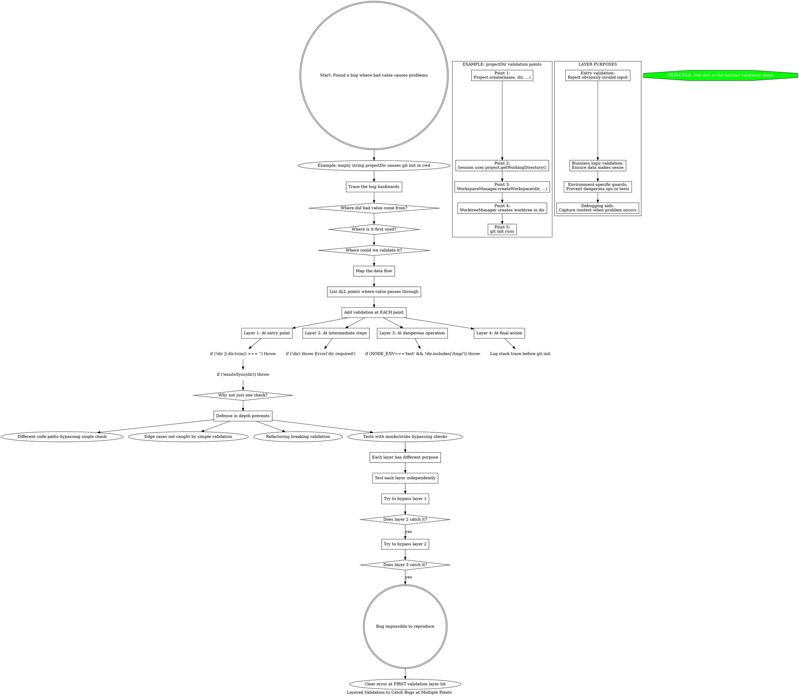

**When to use:** Found a bug where invalid data causes problems deep in the call stack. Want to prevent it completely.

**Strategy:** Add validation at EVERY point the data passes through, not just one place.

**Why it works:**
- Different code paths may bypass any single check
- Each layer has a different purpose (entry, business logic, safety, debugging)
- If one layer is removed during refactoring, others still protect

**Example from this session:** Empty projectDir caught at 4 layers:
1. Project.create checks if empty
2. Project.create checks if exists
3. WorktreeManager checks if empty
4. WorktreeManager NODE_ENV guard checks if in /tmp/

All 4 layers were necessary - removing any one caused bugs to slip through.
