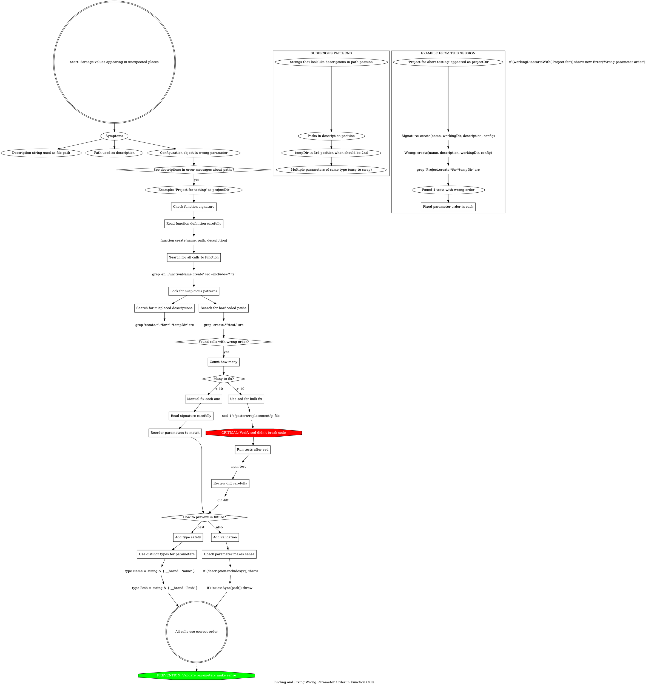

**When to use:** Seeing strange values where they don't belong - descriptions in path fields, paths in description fields, etc.

**Root cause:** Functions with multiple string parameters are easy to swap accidentally.

**Detection:** Grep for patterns like descriptions containing "for testing" in path positions.

**Fix:**
- < 10 calls: Manual fix
- \> 10 calls: Use sed (but verify carefully!)

**Prevention:**
- Use distinct types (branded strings)
- Validate parameters make sense (e.g., paths should exist, descriptions shouldn't start with `/`)

**This session:** Found 4 tests passing `(name, description, workingDir)` instead of `(name, workingDir, description)`.
