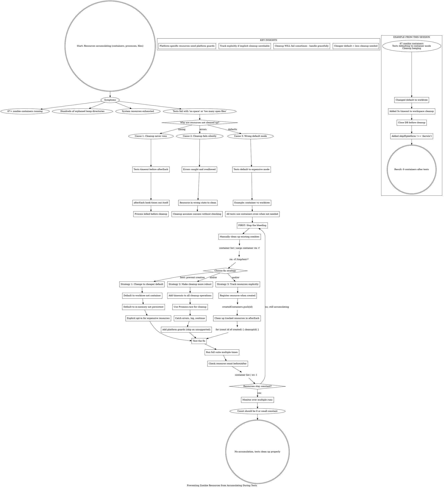

**When to use:** Test runs leave behind zombie processes, containers, temp directories, or other resources.

**Immediate action:** Manually clean up existing zombies before debugging.

**Three-pronged fix:**
1. **Change defaults** to cheaper resources (best: prevent problem)
2. **Improve cleanup** with timeouts and error handling
3. **Track explicitly** if implicit cleanup unreliable

**This session:** Changed default from container to worktree, preventing 67+ zombie containers.
