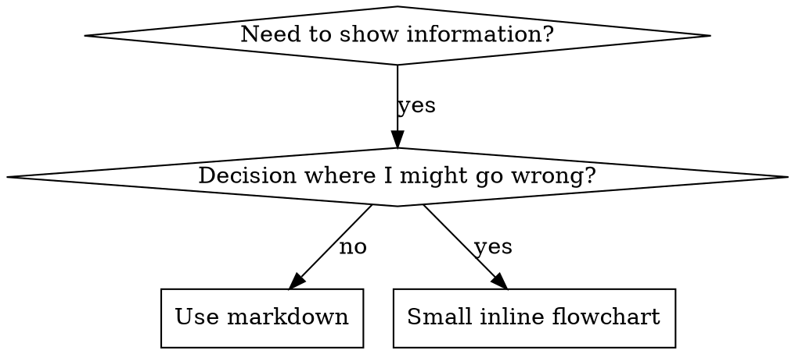

# Skill Creation Guide

## What is a Skill?

A **skill** is a reference guide for proven techniques, patterns, or tools. Skills help future Claude instances find and apply effective approaches.

**Skills are:** Reusable techniques, patterns, tools, reference guides

**Skills are NOT:** Narratives about how you solved a problem once

## When to Create a Skill

**Create when:**
- Technique wasn't intuitively obvious to you
- You'd reference this again across projects
- Pattern applies broadly (not project-specific)
- Others would benefit

**Don't create for:**
- One-off solutions
- Standard practices well-documented elsewhere
- Project-specific conventions (put in CLAUDE.md)

## Skill Types

### Technique
Concrete method with steps to follow (condition-based-waiting, root-cause-tracing)

### Pattern
Way of thinking about problems (flatten-with-flags, test-invariants)

### Reference
API docs, syntax guides, tool documentation (office docs)

All use same structure - type in frontmatter for context, not organization.

## Directory Structure

```
skills/
  skill-name/
    SKILL.md              # Main reference (required)
    supporting-file.*     # Only if needed
```

**Flat namespace** - all skills in one searchable location

**Separate files for:**
1. **Heavy reference** (100+ lines) - API docs, comprehensive syntax
2. **Reusable tools** - Scripts, utilities, templates

**Keep inline:**
- Principles and concepts
- Code patterns (< 50 lines)
- Everything else

## SKILL.md Structure

```markdown
---
name: Human-Readable Name
description: One-line summary of what this does
when_to_use: Symptoms and situations when you need this (CSO-critical)
version: 1.0.0
languages: all | [typescript, python] | etc
type: technique | pattern | reference
dependencies: (optional) Required tools/libraries
---

# Skill Name

## Overview
What is this? Core principle in 1-2 sentences.

## When to Use
[Small inline flowchart IF decision non-obvious]

Bullet list with SYMPTOMS and use cases
When NOT to use

## Core Pattern (for techniques/patterns)
Before/after code comparison

## Quick Reference
Table or bullets for scanning common operations

## Implementation
Inline code for simple patterns
@link to file for heavy reference or reusable tools

## Common Mistakes
What goes wrong + fixes

## Real-World Impact (optional)
Concrete results
```

## Claude Search Optimization (CSO)

**Critical for discovery:** Future Claude needs to FIND your skill

### 1. Rich when_to_use

Include SYMPTOMS not just abstract use cases:

```yaml
# ❌ BAD: Too abstract
when_to_use: For async testing

# ✅ GOOD: Symptoms and context
when_to_use: When tests use setTimeout/sleep and are flaky, timing-dependent,
  pass locally but fail in CI, or timeout when run in parallel
```

### 2. Keyword Coverage

Use words Claude would search for:
- Error messages: "Hook timed out", "ENOTEMPTY", "race condition"
- Symptoms: "flaky", "hanging", "zombie", "pollution"
- Synonyms: "timeout/hang/freeze", "cleanup/teardown/afterEach"
- Tools: Actual commands, library names, file types

### 3. Descriptive Naming

Name by what you DO or the core insight:
- ✅ `condition-based-waiting` > `async-test-helpers`
- ✅ `flatten-with-flags` > `data-structure-refactoring`
- ✅ `root-cause-tracing` > `debugging-techniques`

### 4. Content Repetition

Mention key concepts multiple times:
- In description
- In when_to_use
- In overview
- In section headers

Grep hits from multiple places = easier discovery

## Flowchart Usage



**Use flowcharts ONLY for:**
- Non-obvious decision points
- Process loops where you might stop too early
- "When to use A vs B" decisions

**Never use flowcharts for:**
- Reference material → Tables, lists
- Code examples → Markdown blocks
- Linear instructions → Numbered lists
- Labels without semantic meaning (step1, helper2)

See @graphviz-conventions.dot for graphviz style rules.

## Code Examples

**One excellent example beats many mediocre ones**

Choose most relevant language:
- Testing techniques → TypeScript/JavaScript
- System debugging → Shell/Python
- Data processing → Python

**Good example:**
- Complete and runnable
- Well-commented explaining WHY
- From real scenario
- Shows pattern clearly
- Ready to adapt (not generic template)

**Don't:**
- Implement in 5+ languages
- Create fill-in-the-blank templates
- Write contrived examples

You're good at porting - one great example is enough.

## File Organization

### Self-Contained Skill
```
defense-in-depth/
  SKILL.md    # Everything inline
```
When: All content fits, no heavy reference needed

### Skill with Reusable Tool
```
condition-based-waiting/
  SKILL.md    # Overview + patterns
  example.ts  # Working helpers to adapt
```
When: Tool is reusable code, not just narrative

### Skill with Heavy Reference
```
pptx/
  SKILL.md       # Overview + workflows
  pptxgenjs.md   # 600 lines API reference
  ooxml.md       # 500 lines XML structure
  scripts/       # Executable tools
```
When: Reference material too large for inline

## Anti-Patterns

### ❌ Narrative Example
"In session 2025-10-03, we found empty projectDir caused..."
**Why bad:** Too specific, not reusable

### ❌ Multi-Language Dilution
example-js.js, example-py.py, example-go.go
**Why bad:** Mediocre quality, maintenance burden

### ❌ Code in Flowcharts
```dot
step1 [label="import fs"];
step2 [label="read file"];
```
**Why bad:** Can't copy-paste, hard to read

### ❌ Generic Labels
helper1, helper2, step3, pattern4
**Why bad:** Labels should have semantic meaning

## Skill Creation Checklist

- [ ] Name describes what you DO or core insight
- [ ] YAML frontmatter with rich when_to_use (include symptoms!)
- [ ] Keywords throughout for search (errors, symptoms, tools)
- [ ] Type marked (technique/pattern/reference)
- [ ] Clear overview with core principle
- [ ] Small flowchart only if decision non-obvious
- [ ] Quick reference table
- [ ] Code inline OR @link to separate file
- [ ] Common mistakes section
- [ ] One excellent example (not multi-language)
- [ ] No narrative storytelling
- [ ] Supporting files only for tools or heavy reference

## Discovery Workflow

How future Claude finds your skill:

1. **Encounters problem** ("tests are flaky")
2. **Greps skills** (`grep -r "flaky" ~/.claude/skills/`)
3. **Finds SKILL.md** (rich when_to_use matches)
4. **Scans overview** (is this relevant?)
5. **Reads patterns** (quick reference table)
6. **Loads example** (only when implementing)

**Optimize for this flow** - put searchable terms early and often.
