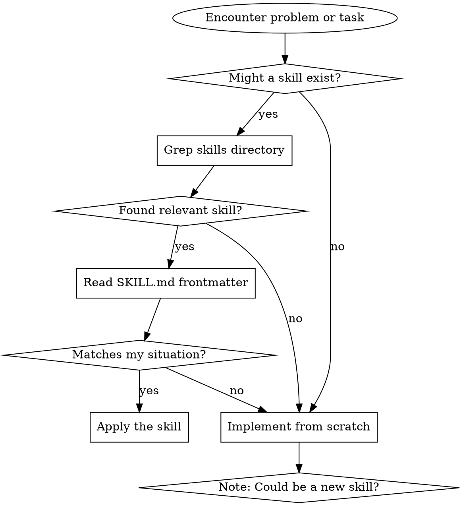

# Using Skills Effectively

## Overview

You have a library of proven techniques, patterns, and tools in `~/.claude/skills/`. Using them saves time and applies battle-tested approaches.

**Core principle:** Check for existing skills before implementing from scratch.

## When to Check for Skills

**Always check when:**
- Starting a new type of task
- Encountering a problem you haven't seen before
- About to write test infrastructure code
- Debugging something confusing
- Jesse says "do you have a skill for this?"

**Quick check before:**
- Writing test synchronization code
- Adding validation
- Debugging infrastructure issues
- Architecting data structures

## How to Search

### Quick Search by Symptom

```bash
# Tests are flaky
grep -r "flaky\|timeout\|race" ~/.claude/skills/ --include="SKILL.md"

# Resource cleanup issues
grep -r "zombie\|cleanup\|hang" ~/.claude/skills/ --include="SKILL.md"

# Architecture decisions
grep -r "nested\|structure\|flag" ~/.claude/skills/ --include="SKILL.md"
```

### Search by Task

```bash
# Looking for techniques
grep -r "technique" ~/.claude/skills/ --include="SKILL.md" | grep "type:"

# Looking for patterns
grep -r "pattern" ~/.claude/skills/ --include="SKILL.md" | grep "type:"

# Looking for references
grep -r "reference" ~/.claude/skills/ --include="SKILL.md" | grep "type:"
```

### List All Skills

```bash
ls -1 ~/.claude/skills/
```

Then scan the directory names for relevant ones.

## Reading a Skill

### 1. Check Frontmatter (5 seconds)
```yaml
when_to_use: [Does this match my situation?]
type: [technique/pattern/reference - what am I getting?]
```

**Decision:** Keep reading or skip?

### 2. Read Overview (10 seconds)
- Core principle
- Is this the right skill?

### 3. Scan Quick Reference (15 seconds)
- Table of common patterns
- Do any match my needs?

### 4. Read Implementation (1-2 minutes)
- Inline code examples
- How to apply this

### 5. Load Supporting Files (only if needed)
- @example.ts when implementing
- @reference.md when need API details
- @script.sh when need the tool

**Total time:** 2-3 minutes to evaluate and understand a skill

## Applying a Skill

### Techniques (condition-based-waiting, root-cause-tracing)
1. Read the core pattern
2. Understand the transformation (before → after)
3. Apply to your code
4. Adapt the example if needed

### Patterns (flatten-with-flags, test-invariants)
1. Understand the mental model shift
2. Evaluate if it applies to your situation
3. Sketch the alternative architecture
4. Implement if benefits are clear

### References (office docs)
1. Find the specific task you need
2. Follow the exact code/workflow
3. Load heavy reference docs when needed
4. Use provided scripts/tools

## When Skill Has a Checklist

**CRITICAL RULE: If a skill has a checklist, you MUST create TodoWrite todos for each item.**

This ensures you:
- Complete all steps systematically
- Don't skip steps
- Track progress visibly
- Can't claim completion without checking all boxes

**Examples of skills with checklists:**
- Creating skills → Todo for each checklist item
- TDD → Todo for each step (write test, watch fail, write code, etc.)
- Systematic debugging → Todo for each phase
- Code review → Todo for each review item
- Any skill with step-by-step process

**The pattern:**
```
1. Load skill with checklist
2. Create TodoWrite todos for EACH checklist item
3. Work through todos systematically
4. Mark complete only when ALL checked
```

**Do NOT:**
- Read checklist and work through it mentally
- Skip creating todos "to save time"
- Batch multiple checklist items into one todo
- Mark items complete without actually doing them

**Why this matters:** Checklists without tracking = steps get skipped. TodoWrite makes the process visible and enforced.

## When Skill Doesn't Quite Fit

**Adapt, don't abandon:**
- Core principle still applies
- Example is in different language → port it
- Pattern needs tweaking → adapt to your context
- Tool needs modification → fork and customize

**Skills are starting points, not rigid rules.**

## Creating New Skills While Working

When you discover something valuable:

```markdown
1. Note in journal: "Learned X technique - worth making a skill"
2. Finish your current task
3. Create the skill while fresh in mind
4. Use the skill-creation skill as guide
```

**Don't interrupt your work** - but don't forget either.

## Common Mistakes

**❌ Not checking:** Implement from scratch when skill exists
**✅ Fix:** Quick grep before starting

**❌ Reading everything:** Load all supporting files immediately
**✅ Fix:** Load on-demand (example.ts only when implementing)

**❌ Rigid application:** Force exact pattern when context different
**✅ Fix:** Adapt principle to your situation

**❌ Analysis paralysis:** Read 5 skills, implement none
**✅ Fix:** Pick most relevant, apply it, iterate

## Quick Reference

| Situation | Action |
|-----------|--------|
| Starting new task | `ls ~/.claude/skills/` - scan for relevant |
| Flaky tests | `grep -r "flaky" ~/.claude/skills/` |
| Resource cleanup | `grep -r "cleanup\|zombie" ~/.claude/skills/` |
| Complex nested data | `grep -r "nested\|flatten" ~/.claude/skills/` |
| Multiple failures | `grep -r "parallel\|agent" ~/.claude/skills/` |
| Unsure what exists | Ask Jesse "do you have a skill for X?" |

## Skill Discovery Workflow



## Integration with Workflow

**Before coding:** Quick skill check (30 seconds)
**While stuck:** Search skills (1 minute)
**After solving:** Consider creating skill (5 minutes)

**Skills are tools, not interruptions.** Use them to work better, not to slow down.
