```dot
digraph PARALLEL_TEST_FIXES {
    label="Using Agents to Fix Multiple Test Files in Parallel";

    // Entry
    "Start: Many test files need same fix" [shape=doublecircle];

    // Identify the pattern
    "Identify the common pattern" [shape=box];
    "What needs to change in each file?" [shape=diamond];

    // Pattern examples
    subgraph cluster_patterns {
        label="COMMON FIX PATTERNS";

        pattern1 [label="Replace hardcoded path with tempDir", shape=ellipse];
        pattern2 [label="Fix parameter order", shape=ellipse];
        pattern3 [label="Add missing imports", shape=ellipse];
        pattern4 [label="Update to new API", shape=ellipse];
        pattern5 [label="Change variable name consistently", shape=ellipse];
    }

    // Create fix template
    "Document the fix pattern" [shape=box];
    "Write exact steps to fix ONE file" [shape=box];

    subgraph cluster_steps {
        label="FIX STEPS TEMPLATE";

        step1 [label="1. Add import X", shape=box];
        step2 [label="2. Add variable Y in beforeEach", shape=box];
        step3 [label="3. Replace pattern A with pattern B", shape=box];
        step4 [label="4. Ensure tests still describe same behavior", shape=box];

        step1 -> step2 -> step3 -> step4;
    }

    // Count files
    "How many files need fixing?" [shape=diamond];
    "Count the files" [shape=box];
    "grep -l 'pattern' src --include='*.test.ts' | wc -l" [shape=plaintext];

    // Decision
    "More than 5 files?" [shape=diamond];

    // Few files: Manual
    "Fix manually (< 5 files)" [shape=box];
    "Apply template to each file" [shape=box];

    // Many files: Use agent
    "Use agent for parallel fixes" [shape=box];

    // Agent dispatch
    "Dispatch one agent task" [shape=box];
    "Agent gets: file list + fix template" [shape=box];

    // Agent prompt structure
    subgraph cluster_prompt {
        label="AGENT PROMPT STRUCTURE";

        prompt1 [label="Fix these N test files to [pattern]", shape=box];
        prompt2 [label="For EACH file:", shape=box];
        prompt3 [label="1. [step 1]", shape=box];
        prompt4 [label="2. [step 2]", shape=box];
        prompt5 [label="3. [step 3]", shape=box];
        prompt6 [label="Example before/after code", shape=box];
        prompt7 [label="This is mechanical refactoring", shape=box];

        prompt1 -> prompt2 -> prompt3 -> prompt4 -> prompt5 -> prompt6 -> prompt7;
    }

    // Validation
    "Agent completes" [shape=box];
    "Review agent's changes" [shape=box];
    "git diff --stat" [shape=plaintext];

    // Check correctness
    "Spot check 2-3 files manually" [shape=box];
    "Does fix match template?" [shape=diamond];

    // Test
    "Run affected tests" [shape=box];
    "npm test -- pattern" [shape=plaintext];

    "Tests pass?" [shape=diamond];

    // Success
    "Commit batch fix" [shape=box];
    "All files fixed consistently" [shape=doublecircle];

    // Rollback
    "Review what went wrong" [shape=box];
    "git reset --hard HEAD" [shape=plaintext];
    "Fix template and retry" [shape=box];

    // Flow
    "Start: Many test files need same fix" -> "Identify the common pattern";
    "Identify the common pattern" -> "What needs to change in each file?";
    "What needs to change in each file?" -> "Document the fix pattern";

    "Document the fix pattern" -> "Write exact steps to fix ONE file";
    "Write exact steps to fix ONE file" -> "How many files need fixing?";

    "How many files need fixing?" -> "Count the files";
    "Count the files" -> "grep -l 'pattern' src --include='*.test.ts' | wc -l";
    "grep -l 'pattern' src --include='*.test.ts' | wc -l" -> "More than 5 files?";

    "More than 5 files?" -> "Fix manually (< 5 files)" [label="no"];
    "More than 5 files?" -> "Use agent for parallel fixes" [label="yes"];

    "Fix manually (< 5 files)" -> "Apply template to each file";
    "Apply template to each file" -> "Run affected tests";

    "Use agent for parallel fixes" -> "Dispatch one agent task";
    "Dispatch one agent task" -> "Agent gets: file list + fix template";
    "Agent gets: file list + fix template" -> "Agent completes";

    "Agent completes" -> "Review agent's changes";
    "Review agent's changes" -> "git diff --stat";
    "git diff --stat" -> "Spot check 2-3 files manually";

    "Spot check 2-3 files manually" -> "Does fix match template?";
    "Does fix match template?" -> "Run affected tests" [label="yes"];
    "Does fix match template?" -> "Review what went wrong" [label="no"];

    "Run affected tests" -> "npm test -- pattern";
    "npm test -- pattern" -> "Tests pass?";

    "Tests pass?" -> "Commit batch fix" [label="yes"];
    "Tests pass?" -> "Review what went wrong" [label="no"];

    "Review what went wrong" -> "git reset --hard HEAD";
    "git reset --hard HEAD" -> "Fix template and retry";
    "Fix template and retry" -> "Dispatch one agent task";

    "Commit batch fix" -> "All files fixed consistently";

    // Key insights
    "INSIGHT: Agent fixes all files in one pass" [shape=octagon, style=filled, fillcolor=yellow];
    "INSIGHT: Template must be VERY specific" [shape=octagon, style=filled, fillcolor=yellow];
    "INSIGHT: Spot check because agents can make systematic errors" [shape=octagon, style=filled, fillcolor=yellow];

    "Dispatch one agent task" -> "INSIGHT: Agent fixes all files in one pass" [style=dotted];
    "Write exact steps to fix ONE file" -> "INSIGHT: Template must be VERY specific" [style=dotted];
    "Spot check 2-3 files manually" -> "INSIGHT: Spot check because agents can make systematic errors" [style=dotted];

    // Example from this session
    subgraph cluster_example {
        label="EXAMPLE FROM THIS SESSION";

        ex_problem [label="8 test files accessing tempDir before beforeEach\nAgent fixed all but swapped parameters in 4 files", shape=ellipse];

        ex_template [label="Template:\n1. Add tempProjectDir variable\n2. Create in beforeEach with join()\n3. Replace hardcoded path\n4. Add imports", shape=plaintext];

        ex_agent_error [label="Agent Error: Swapped workingDir and description\ncreate(name, description, tempDir) ❌\nShould be: create(name, tempDir, description) ✓", shape=ellipse];

        ex_fix [label="Spot checked → found error → manually fixed 4 files", shape=box];

        ex_problem -> ex_template -> ex_agent_error -> ex_fix;
    }

    // When NOT to use agents
    "When NOT to use agent?" [shape=diamond];
    "Fix requires understanding context" [shape=box];
    "Fix requires judgment calls" [shape=box];
    "Each file needs different fix" [shape=box];
    "Use manual fixes instead" [shape=box];
}
```

**When to use:** 10+ test files need the same mechanical fix (add imports, change pattern, update API usage).

**Key insight:** ONE agent can fix all files in parallel if given a precise template.

**Critical:** SPOT CHECK the agent's work - agents can make systematic errors (like swapping parameters).

**Template requirements:**
- Exact step-by-step instructions
- Before/after code examples
- Explicit about what NOT to change
- "This is mechanical refactoring" (sets expectations)

**This session:** Agent fixed 8 test files but swapped parameters in 4 - caught by spot checking.

**When NOT to use:** Fixes require context understanding or judgment calls - do manually.
