```dot
digraph SIMPLIFY_NESTED_DATA {
    label="Simplifying Nested Data Structures with Flags";

    // Entry
    "Start: Complex code with nested data" [shape=doublecircle];

    // Recognition
    "Symptoms of nested complexity" [shape=box];

    subgraph cluster_symptoms {
        label="SYMPTOMS";

        symptom1 [label="Extract and merge logic (60+ lines)", shape=ellipse];
        symptom2 [label="Hydration/serialization code", shape=ellipse];
        symptom3 [label="Special handling for nested data", shape=ellipse];
        symptom4 [label="Confusion about 'real' vs 'virtual' items", shape=ellipse];
        symptom5 [label="Multiple compactions create nested nesting", shape=ellipse];
    }

    // Analysis
    "Ask: What if nested items were first-class?" [shape=diamond];
    "Sketch alternative architecture" [shape=box];

    // Example
    subgraph cluster_before_after {
        label="BEFORE VS AFTER";

        before [label="BEFORE (Nested):\nCOMPACTION {\n  data: {\n    compactedEvents: [e1, e2, e3]\n  }\n}\n\nCode: Extract events, hydrate, merge", shape=plaintext];

        after [label="AFTER (Flat with flags):\ne1 (visibleToModel: false)\ne2 (visibleToModel: false)  \ne3 (visibleToModel: false)\nSUMMARY (visibleToModel: true)\nCOMPACTION (visibleToModel: false)\n\nCode: filter(e => e.visibleToModel !== false)", shape=plaintext];

        before -> after [label="simplify"];
    }

    // Benefits analysis
    "List benefits of flat structure" [shape=box];

    subgraph cluster_benefits {
        label="BENEFITS OF FLAT + FLAGS";

        benefit1 [label="All items are first-class DB rows", shape=ellipse];
        benefit2 [label="No extraction/merging logic", shape=ellipse];
        benefit3 [label="No hydration needed", shape=ellipse];
        benefit4 [label="Simple filter instead of complex builder", shape=ellipse];
        benefit5 [label="Flag is single source of truth", shape=ellipse];
        benefit6 [label="Multiple operations don't nest", shape=ellipse];

        benefit1 -> benefit2 -> benefit3 -> benefit4 -> benefit5 -> benefit6;
    }

    // Migration path
    "Can we migrate without breaking?" [shape=diamond];

    "Check if breaking changes OK" [shape=diamond];
    "Pre-v1 or can tolerate break?" [shape=diamond];

    // Clean break
    "Clean break: Change and update code" [shape=box];
    "Update data structure" [shape=box];
    "Update all producers" [shape=box];
    "Update all consumers" [shape=box];
    "Simplify query/filter code" [shape=box];
    "Delete extraction/merge utilities" [shape=box];

    // Migration needed
    "Write migration script" [shape=box];
    "Extract nested items to flat rows" [shape=box];
    "Set flags appropriately" [shape=box];
    "Run migration on all data" [shape=box];

    // Measure improvement
    "Measure code reduction" [shape=box];
    "git diff --stat" [shape=plaintext];
    "Count lines removed" [shape=box];

    // Validate
    "Run full test suite" [shape=box];
    "npm test" [shape=plaintext];
    "All tests pass?" [shape=diamond];

    // Success
    "Simpler code, same functionality" [shape=doublecircle];
    "Future features easier to add" [shape=ellipse];

    // Flow
    "Start: Complex code with nested data" -> "Symptoms of nested complexity";
    "Symptoms of nested complexity" -> "Ask: What if nested items were first-class?";

    "Ask: What if nested items were first-class?" -> "Sketch alternative architecture" [label="yes, might be simpler"];
    "Sketch alternative architecture" -> "List benefits of flat structure";

    "List benefits of flat structure" -> "Can we migrate without breaking?";
    "Can we migrate without breaking?" -> "Check if breaking changes OK";

    "Check if breaking changes OK?" -> "Pre-v1 or can tolerate break?";
    "Pre-v1 or can tolerate break?" -> "Clean break: Change and update code" [label="yes"];
    "Pre-v1 or can tolerate break?" -> "Write migration script" [label="no"];

    "Clean break: Change and update code" -> "Update data structure";
    "Update data structure" -> "Update all producers";
    "Update all producers" -> "Update all consumers";
    "Update all consumers" -> "Simplify query/filter code";
    "Simplify query/filter code" -> "Delete extraction/merge utilities";

    "Write migration script" -> "Extract nested items to flat rows";
    "Extract nested items to flat rows" -> "Set flags appropriately";
    "Set flags appropriately" -> "Run migration on all data";

    "Delete extraction/merge utilities" -> "Measure code reduction";
    "Run migration on all data" -> "Measure code reduction";

    "Measure code reduction" -> "git diff --stat";
    "git diff --stat" -> "Count lines removed";
    "Count lines removed" -> "Run full test suite";

    "Run full test suite" -> "npm test";
    "npm test" -> "All tests pass?";

    "All tests pass?" -> "Simpler code, same functionality" [label="yes"];
    "All tests pass?" -> "Debug failures" [label="no"];

    "Simpler code, same functionality" -> "Future features easier to add";

    // This session example
    subgraph cluster_this_session {
        label="THIS SESSION EXAMPLE";

        ex_before [label="BEFORE:\ncompactionData.compactedEvents (nested array)\nbuildWorkingConversation: 188 lines\nevent-hydration.ts: 38 lines", shape=plaintext];

        ex_after [label="AFTER:\nvisibleToModel flag (flat)\nbuildWorkingConversation: 122 lines\nevent-hydration.ts: deleted", shape=plaintext];

        ex_reduction [label="Result: ~104 lines removed\n35% reduction in complexity", shape=ellipse];

        ex_before -> ex_after -> ex_reduction;
    }

    // Key decisions
    "DECISION: When is flag better than nesting?" [shape=diamond];

    subgraph cluster_when_flags {
        label="USE FLAGS WHEN";

        when1 [label="Multiple operations modify the set", shape=box];
        when2 [label="Need to query/filter items", shape=box];
        when3 [label="Items are conceptually equal", shape=box];
        when4 [label="Nesting creates nesting on repeat", shape=box];

        when1 -> when2 -> when3 -> when4;
    }

    subgraph cluster_when_nesting {
        label="KEEP NESTING WHEN";

        keep1 [label="True parent-child relationship", shape=box];
        keep2 [label="Different types/schemas", shape=box];
        keep3 [label="Nested items not queryable independently", shape=box];

        keep1 -> keep2 -> keep3;
    }

    // Pattern
    "Pattern: Nested array → Flat + flag" [shape=octagon, style=filled, fillcolor=green, fontcolor=white];
    "Pattern: Complex merge → Simple filter" [shape=octagon, style=filled, fillcolor=green, fontcolor=white];
    "Pattern: Multi-layered nesting → Boolean flag" [shape=octagon, style=filled, fillcolor=green, fontcolor=white];
}
```

**When to use:** Complex code with nested data structures that get extracted, merged, or specially handled.

**Key question:** "What if the nested items were first-class database rows with a flag instead?"

**Benefits:**
- Simpler queries (filter by flag)
- No extraction/merge logic
- No hydration/serialization
- Items are conceptually equal
- Prevents nesting-within-nesting

**Use flags when:**
- Multiple operations modify the collection
- Need to query/filter items
- Items have same type/schema
- Repeat operations create deeper nesting

**Keep nesting when:**
- True parent-child relationship
- Different types
- Nested items never queried independently

**This session:** Changed `compactionData.compactedEvents[]` to `visibleToModel` flag, reduced code by 104 lines.
