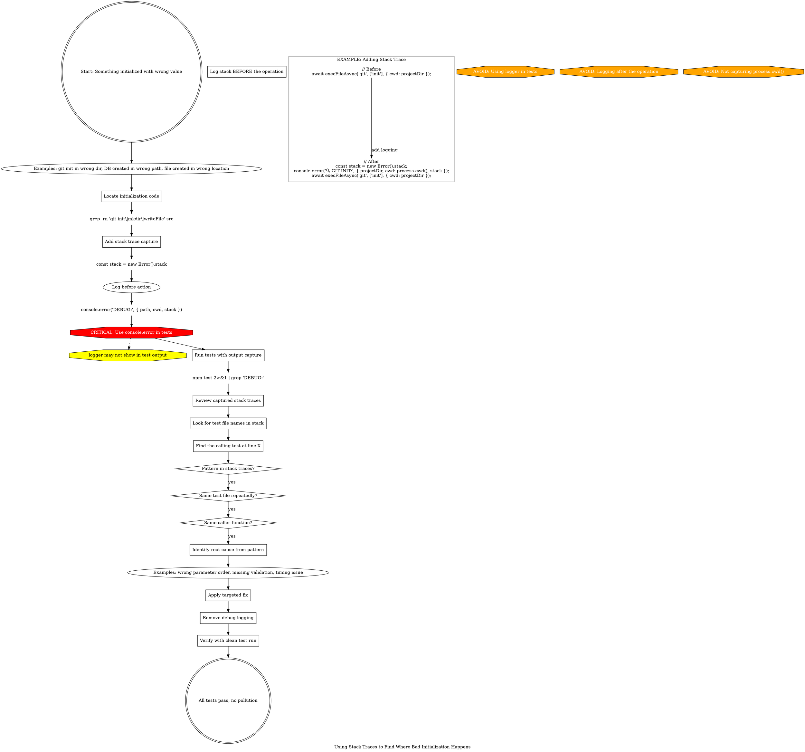

**When to use:** Something is being initialized with the wrong value (path, config, etc.) but you can't tell which code is doing it.

**Key insight:** Stack traces show the exact call chain from test → your code.

**Critical:** Use `console.error()` not `logger` - logger may not appear in test output.

**Pattern:** Add stack capture BEFORE the operation, log the context (path, cwd, etc.) along with stack.
